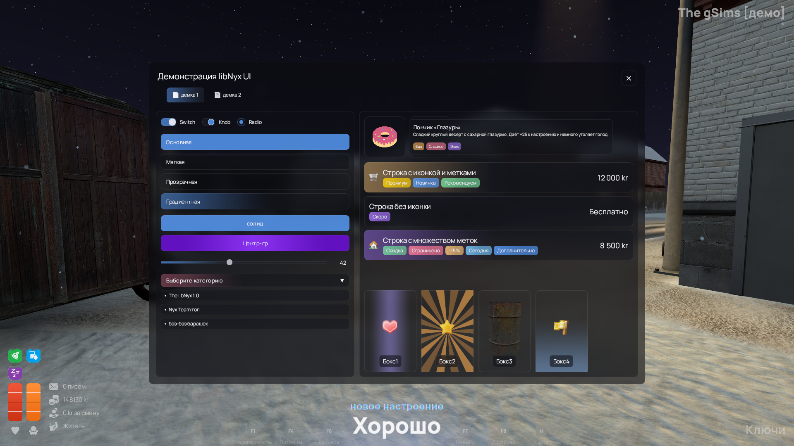
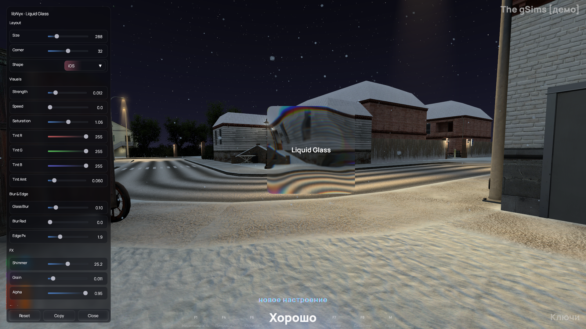

---

# libNyx — Modern UI & Liquid Glass for Garry’s Mod


<p align="center">
  
</p>

<p align="center">
  
</p>

---

## What’s new in v0.7.0 — Liquid Glass


**Liquid Glass** brings iOS-style glassmorphism to GMod with real-time refraction, tinting, shimmer, grain and soft edges, rendered via **RNDX** (SDF-based rounded shapes + post). It includes a live **builder UI** to tweak all parameters and copy the exact chainable code you can paste into your menus/HUDs.

Highlights:

* Real refraction with per-edge smoothing, tint, saturation, shimmer, grain
* Ready-made **Circle / iOS / Figma** shapes (RNDX constants)
* Optional soft shadow pass tuned for glass
* Live draggable preview box with bounds clamping
* One-click **Copy code** outputs your `RNDX().Liquid(...):...:Draw()` chain
* Ships with **libNyx** UI skin, components, sounds, notifications, smooth scroll

---

## Overview

**libNyx** is a modern UI layer for Garry’s Mod focused on:

* Glassy **panels**, **buttons**, **tabs**, **lists**, **dropdowns**, **checkboxes/switches**, **search box**
* A global **menu skin** (Derma menus) and **notification** skin
* Smooth, configurable **scrollbars**
* Design tokens (radius, paddings, fonts, accent color) with dynamic scaling
* A high-level **Liquid Glass** effect powered by **RNDX**

Discord: `https://discord.gg/rUEEz4mfXw`
Author: **MaryBlackfild**

---

## Installation

1. Drop the repository into your server’s or client’s `addons/` as `libnyx/`.
2. Ensure these are present (shipped):

   * `lua/autorun/libnyx.lua` (autoloader + update checker)
   * `lua/libnyx/VERSION` (current version: **0.7.0**)
   * `lua/libnyx/lib/rndx.lua` (RNDX runtime)
   * `lua/libnyx/lib/libnyx_components.lua` (UI kit)
   * `lua/libnyx/lib/libnyx_liquidglass.lua` (Liquid Glass + builder UI)
   * `lua/libnyx/lib/libnyx_maindemo.lua` (UI showcase)
3. Start the game. The autoloader initializes client-side and server-side and will print the detected version and update status.

The loader also pre-creates **font aliases** (`libNyx.<Font>.<size>` and `libNyx.UI.<size>`) with a **Manrope → Tahoma** fallback.

---

## Quick start

### Open the Liquid Glass builder

In the console (client):

```
libnyx_liquid
```

* Drag the glass box around.
* Tweak parameters in the left pane.
* Press **Copy** to put a fully-formed `RNDX().Liquid(...)` chain into your clipboard.

### Open the UI showcase

In the console (client):

```
lua_run_cl if libNyx and libNyx.UI and libNyx.UI.OpenShowcase then libNyx.UI.OpenShowcase() end
```

You’ll see examples of buttons, sliders, tabs, lists, dropdowns, etc., skinned by libNyx.

---

## Liquid Glass — usage in code

The builder outputs code in the canonical format. Example:

```lua
local bx,by,bw,bh = 120,120,300,300
local rr = 32 -- or math.floor(math.min(bw,bh)*0.5) for Circle

RNDX().Liquid(bx,by,bw,bh)
    :Rad(rr)
    :Color(255,255,255,255)
    :Tint(255,255,255)
    :TintStrength(0.06)
    :Saturation(1.06)
    :GlassBlur(0.10,0.0)
    :EdgeSmooth(2.0)
    :Strength(0.012)
    :Speed(0.0)
    :Shimmer(25.2)
    :Grain(0.01)
    :Alpha(0.95)
    :Flags(RNDX.SHAPE_IOS)
    :Shadow(40,56) -- optional
    :Draw()
```

Available shape flags:

* `RNDX.SHAPE_IOS`
* `RNDX.SHAPE_FIGMA`
* `RNDX.SHAPE_CIRCLE` (uses half of min(w,h) as radius internally in the builder)

**Tip:** For circle boxes, set `:Flags(RNDX.SHAPE_CIRCLE)` and use a square `bw == bh`.

---

## UI Kit (Components)

libNyx ships a cohesive set of chain-free components:

* **Frame**: `libNyx.UI.CreateFrame({ w, h, title })`
* **Panels** (glass or solid): `libNyx.UI.Draw.Panel(...)` / `libNyx.UI.Draw.Glass(...)`
* **Buttons** (primary, ghost, gradient, center duo)
* **Checkboxes / Radio / Switch**
* **Slider** (with gradient fill, hover/drag animation)
* **Dropdown** (animated popup, icons, gradient hover)
* **List** (rows with chips, gradient rails, selection)
* **Category cards** (vibrant or glass)
* **Search box** (RU/EN hint, clear button, gradient rail)
* **Tabs** (animated indicator)
* **Smooth scroll** installer for any `DScrollPanel`

Sounds are normalized globally so old Derma SFX map to your custom set:

```lua
libNyx.UI.Sounds = {
  hover = "nyx_uniqueui/nyxclick_2.wav",
  click = "nyx_uniqueui/nyxclick_3.wav"
}
```

---

## Global skins

### Menu (Derma)

Installed automatically on client init:

```lua
libNyx.UI.InstallGlobalMenuSkin()
```

* Rounded, blurred, stroked background
* Hover/active rows with animated opacity
* Unified font via `libNyx.UI.Font(size)`

### Notifications

libNyx replaces `notification.AddLegacy/AddProgress/Kill` with a glassy **toast** system (right side, vertical stack).
Use anywhere:

```lua
notification.AddLegacy("Hello from libNyx", NOTIFY_HINT, 3)
```

---

## Scaling, fonts, tokens

* `cl_libnyx_ui_scale` — manual UI scale (0 = auto by screen height)
* Base tokens live in `libNyx.UI.Style`:

  * `radius, padding, iconSize, btnHeight, rowHeight, shadowSpread, shadowIntensity, textColor, accentColor, panelColor, cardColor, glassFill, glassStroke, ...`
* `libNyx.UI.Scale(n)` and `libNyx.UI.Font(px)` are the only sizing APIs you should call directly.

The loader pre-creates size-namespaced fonts:

* `libNyx.<Manrope|Tahoma>.<size>`
* `libNyx.UI.<size>`

---

## Demos

* **Liquid builder**: `libnyx_liquid`
* **UI Showcase**: `lua_run_cl libNyx.UI.OpenShowcase()`

---

## ConVars

Client:

* `cl_libnyx_ui_scale` (`0`..`2`) — UI scale (0 = auto)
* `libnyx_liquid_size` — default builder box side (px)

---

## Autoloader & Update Check

`lua/autorun/libnyx.lua`:

* Reads local `VERSION` (or `lua/libnyx/VERSION`)
* Compares to GitHub raw (fallback: parses `libnyx_loader.lua`)
* Adds required client files via `AddCSLuaFile`
* Boots RNDX, components, main demo, and liquid module once per session
* Installs global menu + notification skins

You’ll see console prints like:

```
[libNyx] Loaded v0.7.0 (client)
[libNyx] Up-to-date ✓ (latest: v0.7.0)
```

---

## Minimal example (custom frame + glass content)

```lua
if CLIENT then
  local f = libNyx.UI.CreateFrame({ w = 960, h = 640, title = "My libNyx window" })
  local pnl = vgui.Create("DPanel", f)
  pnl:Dock(FILL)
  pnl.Paint = function(_, w, h)
    libNyx.UI.Draw.Glass(24, 72, w-48, h-96, {
      radius = libNyx.UI.Scale(18),
      fill   = libNyx.UI.Style.bgColor,
      stroke = true,
      blurIntensity = 1.1
    })

    local x,y,w2,h2 = 48, 120, 320, 220
    RNDX().Liquid(x,y,w2,h2)
      :Rad(libNyx.UI.Scale(18))
      :Color(255,255,255,255)
      :Tint(255,255,255)
      :TintStrength(0.08)
      :Saturation(1.06)
      :GlassBlur(0.10,0.38)
      :EdgeSmooth(2.0)
      :Strength(0.014)
      :Speed(0.35)
      :Shimmer(22.0)
      :Grain(0.005)
      :Alpha(0.95)
      :Flags(RNDX.SHAPE_IOS)
      :Shadow(40,56)
      :Draw()
  end
end
```

---

## Integration notes

* Always call **libNyx** APIs (don’t copy internal helpers).
* Prefer `libNyx.UI.Draw.*` and `libNyx.UI.Components.*` over raw Derma painting.
* For long pages, wrap in `DScrollPanel` and run:

  ```lua
  libNyx.UI.SmoothScroll.ApplyToScrollPanel(myScrollPanel, { step = libNyx.UI.Scale(90), speed = 18 })
  ```
* Notifications are already hooked into `notification.*` and `GM:AddNotify`. You can still call your own toasts via `libNyx.UI.PushNotify`.

---

## Troubleshooting

* **Fonts missing**: we fall back to Tahoma automatically; ensure “Manrope” is installed for best look.
* **Nothing draws / NIL globals**: make sure `libnyx.lua` runs in `lua/autorun/`, and don’t sandbox-include only a subset of files. The loader gates readiness and retries includes until the UI is up.
* **Hover slots / sliders not reacting**: rely on the loader to include and defer until `libNyx.Ready` is true (the loader already does a timed gate).

---

## License

See repository license headers. Shader and RNDX integration are credited in-file.

---

## Credits

* **MaryBlackfild** — libNyx UI, Liquid Glass, integration & demos
* **Srlion** — RNDX base (rounded SDF + post) foundation & utilities

---

## Changelog

### 0.7.0

* Added **Liquid Glass** effect and live builder (`libnyx_liquid`)
* New notification skin (glass toasts with progress)
* Menu skin refinements and smooth scroll polish
* Expanded component set and gradients
* Loader robustness: font aliases, readiness gate, update checker fallback

---

### Internal plan for this update (for maintainers)

* Place `libnyx_demo.gif` at the top as the hero preview.
* Show branding images (`libnyx.png`, `liquid.png`) directly below the hero.
* Introduce a “What’s new” section dedicated to Liquid Glass, with `libnyx_liquid.gif`.
* Document the `libnyx_liquid` console command, builder parameters, and exported code format.
* Surface essential APIs: Draw, Components, Notifications, SmoothScroll, scaling tokens, fonts.
* Call out loader behavior (version check, readiness gate).
* Provide minimal copy-paste snippets that match builder output.
* Add Troubleshooting tailored to include order/readiness and font fallback.

---

